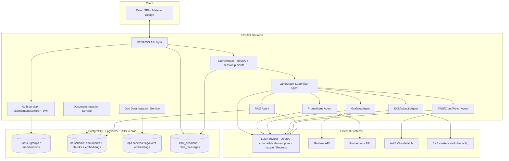

# Architecture

See [[00-overview]] for scope and decisions this builds on.

## 1. Tech stack

| Layer | Choice |
|---|---|
| Frontend | React (Vite or Next.js — final choice made in `frontend` repo), Material Design via MUI |
| Backend API | Python, FastAPI |
| Agent orchestration | LangGraph (query orchestrator + multi-agent supervisor, see [[08-chat-sessions-and-orchestration]] and [[03-agent-and-integrations]]) |
| Database | PostgreSQL with `pgvector` extension (single instance, multiple schemas — see [[02-access-control-and-rag]]) |
| LLM model | Llama 4 Scout (large context window — enables whole-document-as-one-chunk, see [[02-access-control-and-rag]]) |
| LLM (dev) | A generic OpenAI-compatible adapter (currently nscale), via generic env vars |
| LLM (prod) | AWS Bedrock, via the same generic env vars, different values |
| Embedding model | `BAAI/bge-large-en-v1.5`, local, baked into the backend Docker image at build time — no Hugging Face access at runtime (corporate network restriction). Same in dev and prod. See [[06-deployment-and-environments]] §2a. |
| Local deploy | Docker + Docker Compose on an Ubuntu VM |
| Prod deploy | AWS EKS (app workloads) + AWS RDS for PostgreSQL (with pgvector) |

## 2. High-level component diagram

## 3. Repo topology

A single monorepo (decision recorded in [[00-overview]]) with one GitHub remote:

- **`docs/`** — all requirement/architecture markdown, source of truth.
- **`frontend/`** — the React app.
- **`backend/`** — FastAPI app, LangGraph agents, ingestion services, DB migrations.
- **`infra/`** — `docker-compose/` for local dev, `eks/` + `terraform/` for prod deployment manifests.

See [[07-repo-structure-and-conventions]] for the full layout and conventions.

## 4. Data flow summary

**Chat / investigation query:**
1. User sends a message via the React UI to the FastAPI `/chat` endpoint (JWT-authenticated), tied to a `chat_session`.
2. Backend resolves the user's group memberships and personal KB id.
3. The **Orchestrator** classifies the message (`general` / `document_topic` / `live_ops`) and, for a `document_topic` message, manages the session's document-pin state (auto-pin on a dominant match, or LLM-judged drift check if already pinned) — see [[08-chat-sessions-and-orchestration]] for the full state machine.
4. The LangGraph supervisor agent then routes to the relevant subgraph(s) based on the Orchestrator's classification.
5. The RAG agent queries pgvector, filtered to `groups the user belongs to UNION user's personal KB` (or, for a pinned session, to just the pinned document) — see [[02-access-control-and-rag]].
6. Domain agents (AWS/EKS/Grafana/Prometheus) call their respective read-only tools when the supervisor routes to them — always allowed regardless of the session's pin state.
7. Results are synthesized into a single answer, streamed back to the UI, with tool-call/citation transparency (which docs / which live queries were used). If the Orchestrator detected drift instead, the assistant returns a redirect message rather than an answer (see [[08-chat-sessions-and-orchestration]] §6).
8. v1 is advisory-only — no agent may execute a mutating action (see [[03-agent-and-integrations]] guardrails).

**Document ingestion:**
1. User (or superuser) uploads a file (PDF/DOCX/MD/TXT) via the UI, selecting which group(s) — or "personal" — it belongs to.
2. Ingestion service parses, chunks, embeds, and stores it in the `kb` schema with group-tag metadata.

**Ops data ingestion (logs, for day-to-day SRE activity):**
1. A separate ingestion path (pull or push) feeds operational data (log excerpts, incident notes, alert payloads) into the `ops` schema, tagged with source/cluster/time, with its own retention/TTL policy — independent of the document KB.

## 5. Environments

Two environments to design for from day one, using the same codebase and a provider-abstraction layer for the LLM (see [[06-deployment-and-environments]] for the full env var contract):

- **Local/dev**: Ubuntu VM, Docker Compose (Postgres+pgvector container, backend container, frontend dev server), LLM = OpenAI-compatible endpoint (currently nscale).
- **Prod**: AWS EKS (backend + frontend as separate deployments/services, or frontend on S3+CloudFront — decide in `infra`), AWS RDS for Postgres+pgvector, LLM = AWS Bedrock.
