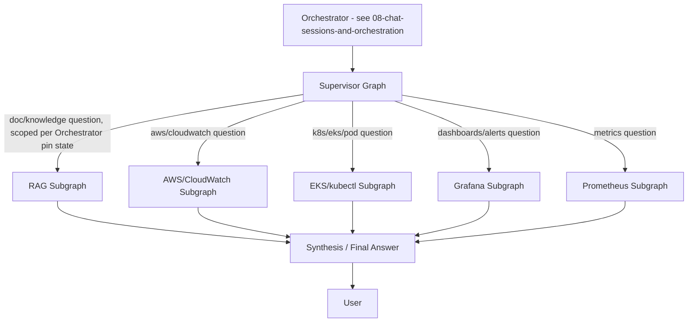

# Agent Design & Integrations

See [[00-overview]], [[01-architecture]]. This doc covers the LangGraph agent topology, the v1 tool/integration contracts, and the safety guardrails that make "advisory only" actually true in the implementation, not just in intent.

> Note: message classification, chat-session document pinning, and topic-drift handling are owned by the **Orchestrator**, which runs before the Supervisor graph described here — see [[08-chat-sessions-and-orchestration]] for that state machine. This doc assumes the Orchestrator has already decided the message needs Supervisor routing (i.e. it's a `document_topic` or `live_ops` message, not `general` small talk).

## 1. Multi-agent topology (decision: multi-agent subgraphs)



- **Supervisor graph**: fans out to one or more domain subgraphs based on the Orchestrator's classification (a single `document_topic`+`live_ops` mixed turn — e.g. "why is checkout-service crashlooping" — may hit the K8S subgraph for pod status/logs *and* the Grafana subgraph for error-rate dashboards *and* the RAG subgraph for a relevant runbook). When the Orchestrator has pinned the session to a document, the Supervisor passes that constraint through to the RAG subgraph so it only retrieves from that one document (see [[02-access-control-and-rag]] §4 and [[08-chat-sessions-and-orchestration]] §5–6).
- **Domain subgraphs**: each owns its own tool set, its own system prompt/expertise framing, and its own guardrails (e.g. the K8S subgraph only ever calls read verbs).
- **Synthesis node**: merges subgraph outputs into one answer, preserving citations (which doc, which cluster/pod, which dashboard/query) so the engineer can verify.

This is more upfront design than a single router-with-tools agent, but it scales cleanly as more integrations are added (decision recorded in [[00-overview]]).

## 2. v1 integrations & tool contracts

All tools in v1 are **read-only**. No tool in this list may create, update, delete, restart, scale, or otherwise mutate anything.

### RAG subgraph
- `retrieve_documents(query, user_id, pinned_document_id=None) -> [chunk, source_document, score]` — applies the access-control filter from [[02-access-control-and-rag]] §7 unconditionally. When `pinned_document_id` is set (session is document-pinned, per [[08-chat-sessions-and-orchestration]]), retrieval is further restricted to that document's chunk(s) only, regardless of what the broader group/personal KB might otherwise surface.

### AWS / CloudWatch subgraph
- `cloudwatch_query_logs(log_group, filter_pattern, time_range) -> [log_lines]` (CloudWatch Logs Insights).
- `cloudwatch_get_metric(namespace, metric_name, dimensions, time_range, stat) -> [datapoints]`.
- Auth: scoped IAM role/credentials, read-only IAM policy (`logs:StartQuery`, `logs:GetQueryResults`, `cloudwatch:GetMetricData`, etc. — no `*:Put*`, `*:Delete*`, `*:Terminate*`, etc.).

### EKS / kubectl subgraph
- `k8s_get_pods(cluster, namespace) -> [pod status]`.
- `k8s_describe_pod(cluster, namespace, pod) -> description`.
- `k8s_get_pod_logs(cluster, namespace, pod, container, tail_lines) -> [log lines]`.
- `k8s_get_events(cluster, namespace) -> [events]`.
- `k8s_get_deployment_status(cluster, namespace, deployment) -> rollout status`.
- Auth: a service account per configured cluster with an RBAC `ClusterRole` restricted to `get`/`list`/`watch` on pods, deployments, events, logs — explicitly **no** `create`/`update`/`patch`/`delete`.

### Grafana subgraph
- `grafana_query_dashboard(dashboard_uid) -> panel summaries`.
- `grafana_get_active_alerts() -> [alert]`.
- Auth: a Grafana API key/service account with viewer-only permissions.

### Prometheus subgraph
- `prometheus_instant_query(promql) -> result`.
- `prometheus_range_query(promql, start, end, step) -> result`.
- `alertmanager_get_active_alerts() -> [alert]`.
- Auth: read-only endpoint access (network-level restriction is enough if Prometheus has no auth of its own; otherwise a read-only token).

## 3. Guardrail principle: enforce read-only in the tool layer, not the prompt

The system prompt telling the agent "you are advisory only, never execute changes" is a *courtesy*, not the control. The actual guardrail is:
1. **No mutating tool exists.** The tool registry passed to every subgraph literally does not contain a create/update/delete/restart/scale function. There is nothing for the LLM to misuse into a destructive action, regardless of prompt injection or hallucination.
2. **Credentials are scoped read-only at the infra layer** (IAM policy, k8s RBAC, Grafana viewer role) as a second, independent layer — even if a future bug added a mutating tool by mistake, the underlying credentials would reject the call.
3. When the agent wants to *propose* a remediation (e.g. "run `kubectl rollout restart deployment/checkout-service -n prod`"), it renders that as a **suggested command in chat** for the engineer to copy/run themselves — it is text output, not a tool invocation.

## 4. Group-to-integration scope mapping

Just as documents are tagged to groups, live-data integrations are scoped by group too, so an AI Engineer on `project-atlas` doesn't get EKS pod access to a cluster that belongs to a different team:

```
integration_scope:
  id: uuid
  group_id: group_id
  integration_type: "aws_cloudwatch" | "eks" | "grafana" | "prometheus"
  config: jsonb   # e.g. {"cluster_name": "prod-atlas", "aws_account_id": "...", "region": "..."}
```

When the supervisor routes to a domain subgraph, it first resolves which `integration_scope` rows apply to the requesting user's groups, and only queries those specific clusters/accounts/dashboards — never "all clusters the backend happens to have credentials for."

## 5. Future work (explicitly deferred, not built in v1)

- Confirm-then-execute or allowlisted-playbook autonomy tiers (both were considered and deferred in favor of advisory-only — see [[00-overview]] decision log). When revisited, they should be added as a distinct, explicitly-opt-in tool tier, not a loosening of the v1 tools.
- Additional integrations (PagerDuty/Opsgenie, Slack notifications, Confluence sync).
- Cross-cluster/cross-account auto-discovery (v1 requires explicit `integration_scope` config).
