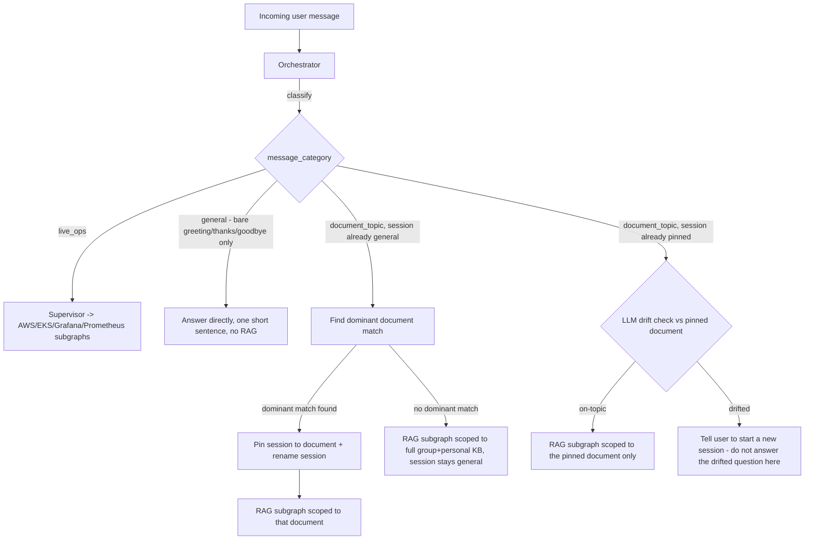

# Chat Sessions & Query Orchestration

See [[00-overview]], [[01-architecture]], [[02-access-control-and-rag]] (chunking/retrieval), [[03-agent-and-integrations]] (LangGraph subgraphs this orchestrator routes into).

## 1. Why this exists

Two things drove this design (see decision log in [[00-overview]]):
1. Every user message must first be **categorized** (general chat vs. a specific document topic vs. a live-ops/investigation question) before it's routed anywhere.
2. Once a chat session is recognized as being about a specific **document**, it should **stay fixed to that document's content** for the rest of the conversation — if the user drifts to a different topic, the assistant tells them to start a new session rather than silently changing what it's answering from.

This keeps each session's answers grounded in one consistent, known source, and keeps session history/titles meaningful (a user's session list reads like a table of contents, not a wall of "New Chat"s).

## 2. Chat session data model

```
chat_sessions:
  id: uuid
  user_id: uuid
  title: string                     # "New Chat" until pinned; becomes the document's title once pinned
  status: "general" | "pinned"
  pinned_document_id: uuid | null   # set only when status == "pinned"
  pinned_at: timestamp | null
  created_at: timestamp
  updated_at: timestamp

chat_messages:
  id: uuid
  session_id: uuid
  role: "user" | "assistant"
  content: string
  message_category: "general" | "document_topic" | "live_ops" | null   # orchestrator's classification of this message
  created_at: timestamp
```

A session starts in `general` status with a placeholder title. It transitions to `pinned` the first time the orchestrator finds a *dominant* single-document match for a message (§4). Once `pinned`, `pinned_document_id` and `title` do not change for the lifetime of that session — the only way to talk about a different document is a new session.

## 3. Orchestrator's place in the flow

The Orchestrator is a node that runs **before** the Supervisor's subgraph routing described in [[03-agent-and-integrations]] §1. It doesn't replace the Supervisor — it decides *what the Supervisor is allowed to work with* for this message, and owns the session's pin/title state.



## 4. Classification categories

This assistant does not hold open-ended conversations and does not answer from its own general/outside knowledge — it only ever answers from the document knowledge base (or live-ops tool output). Classification is deliberately narrow about what counts as `general`, so it doesn't leak into open-ended chat (decision recorded in [[00-overview]]):

- **`general`** — **only** a bare greeting, thanks, or goodbye and nothing else ("hi", "good morning", "thanks!", "bye"). Answered directly in one short, plain sentence — no Markdown, no bullet lists, and critically no fabricated menu of "things I can help with," since the assistant doesn't actually know the knowledge base's contents well enough to promise categories. No retrieval, no effect on session state.
- **`live_ops`** — questions about live production state: pods, deployments, CloudWatch logs/metrics, Grafana dashboards, Prometheus/Alertmanager. Always routed to the relevant domain subgraph(s) in [[03-agent-and-integrations]], **regardless of the session's pin state** (decision recorded in [[00-overview]]) — a doc-pinned session can still be asked live-ops questions without triggering drift or needing a new session.
- **`document_topic`** — the default for everything else: statements, questions, vague requests, anything that isn't a bare social nicety and could plausibly relate to internal documentation, including short follow-ups continuing such a conversation. The classifier is instructed to prefer this category when unsure — e.g. a statement like "I am a new joinee" (not phrased as a question) is `document_topic`, not `general`. Whether the KB actually has an answer is decided afterward by retrieval (§5-6), not by classification.

The RAG answering prompt (`app/agents/rag_agent.py`) enforces the same no-general-knowledge boundary on the answer itself: if retrieved context doesn't contain the answer, it says so rather than filling the gap from the model's own knowledge, and it never names or describes the source document by title/filename (only a generic framing like "Based on the knowledge I have...").

## 5. Auto-pinning (first document_topic message in a `general` session)

When a `general`-status session receives a `document_topic` message:
1. Run retrieval against the full scope normally available to the user (group + personal KB, per [[02-access-control-and-rag]] §7).
2. Check whether one document is a **dominant match** — its top-ranked relevance score clearly exceeds the next *distinct* document's score by a configurable margin (exact threshold/margin is an implementation-time tuning value, not fixed by these docs — see [[00-overview]] §6).
3. **If dominant**: pin the session (`status = pinned`, `pinned_document_id = <that document>`), rename the session title to that document's title (or a short LLM-cleaned version of it if the raw filename/title is unhelpful), and answer using retrieval scoped to that document only (per the mixing rules in [[02-access-control-and-rag]] §4 — still reason over the relevant part of it, don't blanket-summarize).
4. **If not dominant** (query is genuinely cross-document, or ambiguous): answer using the normal multi-document retrieval, and leave the session in `general` status. A *later* message in the same session can still trigger pinning if it produces a dominant match — pinning isn't limited to only the very first message.

## 6. Drift detection (once `pinned`)

Every subsequent `document_topic` message in a `pinned` session is checked with an **LLM judgment call** (decision recorded in [[00-overview]]) — a lightweight classification prompt that gets the pinned document's identity/summary plus the new message, and returns whether the message is still on-topic for that document, and if not, a short label for what it looks like instead.

- **On-topic**: answer normally, retrieval scoped only to `pinned_document_id`.
- **Drifted**: the assistant does **not** answer the drifted question in this session. It responds with a short redirect, e.g.: *"This looks like a different topic than '<pinned document title>'. Start a new chat to ask about that."* The UI should offer a one-click "Start new session" action, ideally pre-filled with the drifted message so the user doesn't have to retype it (see [[04-frontend-ui]]).

`live_ops` messages skip this check entirely (§4) — drift detection only applies to `document_topic` messages.

## 7. What this doesn't do (v1 scope)

- No mid-session "unpinning" or re-pinning to a different document — that's what starting a new session is for. (Deleting the pinned document itself is the one exception: the session degrades to `general` rather than pointing at nothing — see `backend/app/api/routes/documents.py`.)
- No automatic creation of the suggested new session — the user must explicitly start it (via the UI action), consistent with advisory-only behavior elsewhere in this system ([[00-overview]], [[03-agent-and-integrations]]): the assistant suggests, the human acts.
- The dominant-match margin and the drift-check prompt are implementation details to tune in `backend`, not fixed numbers specified here.

## 8. Conversation history feeds every step — not just the latest message

Classification (§4), drift-check (§6), and the actual answers (RAG and general chat alike) are all given the recent conversation history (`backend/app/agents/orchestrator.py`), not just the newest message in isolation. This matters concretely: a short follow-up like "what next?" or a one-word answer to a question the assistant just asked is unreadable without the prior turns — judged alone, it reads as unrelated ("general"/drifted) and gets answered as a context-free guess instead of a grounded continuation. The retrieval query itself is also context-enriched (`contextualized_search_query` in `rag_agent.py`), since a bare short phrase embeds too weakly on its own to find the right chunks even when classification is correct.

`backend/tests/e2e/` has live conversation tests (real LLM, real embeddings) guarding this specific behavior — run on demand (`pytest -m e2e`, see that directory's README), not automatically, since they're slow and cost real inference calls.

## 9. `general` is intentionally narrow — no open-ended chat

Earlier, `general` covered anything conversational, including plain statements like "I am a new joinee" — this let the assistant fall back to inventing a plausible-sounding but ungrounded reply (e.g. a fabricated "Welcome to the team! Here's what I can help with..." bullet menu) instead of treating it as something to look up. Since the assistant's whole purpose is to answer from real documentation, that's a hallucination risk dressed up as friendliness.

`general` now matches only a bare greeting/thanks/goodbye (§4); everything else defaults to `document_topic` and goes through real retrieval, so an unanswerable question gets an honest "I couldn't find anything relevant to that" (`app/agents/rag_agent.py`) instead of a made-up answer. `TestGeneralChat` in `backend/tests/e2e/test_chat_conversations.py` guards both the narrow classification boundary and the no-fabricated-menu behavior.
