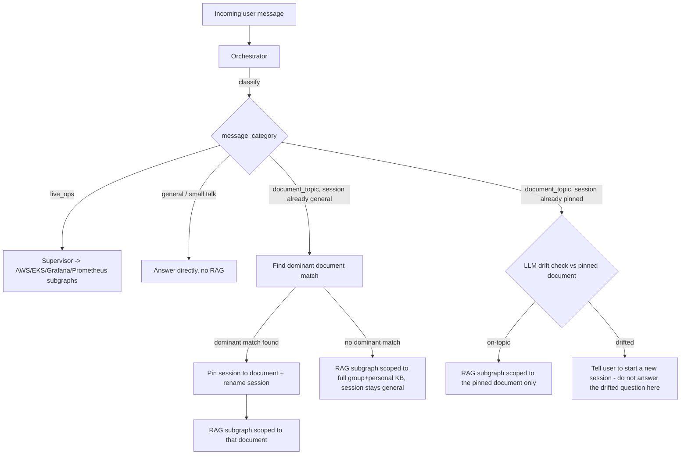

# Chat Sessions & Query Orchestration

See [[00-overview]], [[01-architecture]], [[02-access-control-and-rag]] (chunking/retrieval), [[03-agent-and-integrations]] (LangGraph subgraphs this orchestrator routes into).

## 1. Why this exists

Two things drove this design (see decision log in [[00-overview]]):
1. Every user message must first be **categorized** (general chat vs. a specific document topic vs. a live-ops/investigation question) before it's routed anywhere.
2. Once a chat session is recognized as being about a specific **document**, it should **stay fixed to that document's content** for the rest of the conversation — if the user drifts to a different topic, the assistant tells them to start a new session rather than silently changing what it's answering from.

This keeps each session's answers grounded in one consistent, known source, and keeps session history/titles meaningful (a user's session list reads like a table of contents, not a wall of "New Chat"s).

## 2. Chat session data model

```
chat_sessions:
  id: uuid
  user_id: uuid
  title: string                     # "New Chat" until pinned; becomes the document's title once pinned
  status: "general" | "pinned"
  pinned_document_id: uuid | null   # set only when status == "pinned"
  pinned_at: timestamp | null
  created_at: timestamp
  updated_at: timestamp

chat_messages:
  id: uuid
  session_id: uuid
  role: "user" | "assistant"
  content: string
  message_category: "general" | "document_topic" | "live_ops" | null   # orchestrator's classification of this message
  created_at: timestamp
```

A session starts in `general` status with a placeholder title. It transitions to `pinned` the first time the orchestrator finds a *dominant* single-document match for a message (§4). Once `pinned`, `pinned_document_id` and `title` do not change for the lifetime of that session — the only way to talk about a different document is a new session.

## 3. Orchestrator's place in the flow

The Orchestrator is a node that runs **before** the Supervisor's subgraph routing described in [[03-agent-and-integrations]] §1. It doesn't replace the Supervisor — it decides *what the Supervisor is allowed to work with* for this message, and owns the session's pin/title state.



## 4. Classification categories

Every message is classified into exactly one of:

- **`general`** — greetings, small talk, meta questions about the assistant itself ("what can you help me with?"). Answered directly, no retrieval, no effect on session state.
- **`live_ops`** — questions about live production state: pods, deployments, CloudWatch logs/metrics, Grafana dashboards, Prometheus/Alertmanager. Always routed to the relevant domain subgraph(s) in [[03-agent-and-integrations]], **regardless of the session's pin state** (decision recorded in [[00-overview]]) — a doc-pinned session can still be asked live-ops questions without triggering drift or needing a new session.
- **`document_topic`** — a question that should be answered from the document knowledge base. This is the category that drives pinning.

## 5. Auto-pinning (first document_topic message in a `general` session)

When a `general`-status session receives a `document_topic` message:
1. Run retrieval against the full scope normally available to the user (group + personal KB, per [[02-access-control-and-rag]] §7).
2. Check whether one document is a **dominant match** — its top-ranked relevance score clearly exceeds the next *distinct* document's score by a configurable margin (exact threshold/margin is an implementation-time tuning value, not fixed by these docs — see [[00-overview]] §6).
3. **If dominant**: pin the session (`status = pinned`, `pinned_document_id = <that document>`), rename the session title to that document's title (or a short LLM-cleaned version of it if the raw filename/title is unhelpful), and answer using retrieval scoped to that document only (per the mixing rules in [[02-access-control-and-rag]] §4 — still reason over the relevant part of it, don't blanket-summarize).
4. **If not dominant** (query is genuinely cross-document, or ambiguous): answer using the normal multi-document retrieval, and leave the session in `general` status. A *later* message in the same session can still trigger pinning if it produces a dominant match — pinning isn't limited to only the very first message.

## 6. Drift detection (once `pinned`)

Every subsequent `document_topic` message in a `pinned` session is checked with an **LLM judgment call** (decision recorded in [[00-overview]]) — a lightweight classification prompt that gets the pinned document's identity/summary plus the new message, and returns whether the message is still on-topic for that document, and if not, a short label for what it looks like instead.

- **On-topic**: answer normally, retrieval scoped only to `pinned_document_id`.
- **Drifted**: the assistant does **not** answer the drifted question in this session. It responds with a short redirect, e.g.: *"This looks like a different topic than '<pinned document title>'. Start a new chat to ask about that."* The UI should offer a one-click "Start new session" action, ideally pre-filled with the drifted message so the user doesn't have to retype it (see [[04-frontend-ui]]).

`live_ops` messages skip this check entirely (§4) — drift detection only applies to `document_topic` messages.

## 7. What this doesn't do (v1 scope)

- No mid-session "unpinning" or re-pinning to a different document — that's what starting a new session is for.
- No automatic creation of the suggested new session — the user must explicitly start it (via the UI action), consistent with advisory-only behavior elsewhere in this system ([[00-overview]], [[03-agent-and-integrations]]): the assistant suggests, the human acts.
- The dominant-match margin and the drift-check prompt are implementation details to tune in `sre-ai-backend`, not fixed numbers specified here.
